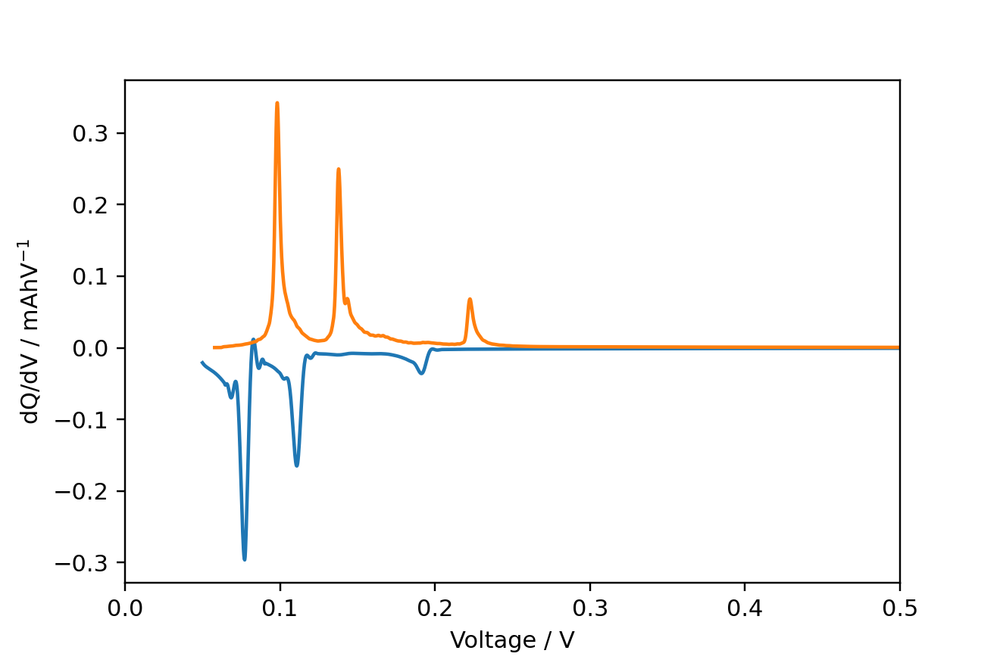

# navani
Module for processing and plotting electrochemical data from battery cyclers. Conatins functions to extract dQ/dV.

The main dependencies are galvani and mdbtools.

galvani : https://github.com/echemdata/galvani
This can be installed using pip:
`pip install galvani`

mdbtools
This can be installed on linux and mac using:
`sudo apt install mdbtools`


```
import pandas as pd
import navani.echem as ec

df = ec.echem_file_loader(filepath)
fig, ax = ec.charge_discharge_plot(df, 1)
```


```
for cycle in [1, 2]:
    mask = df['half cycle'] == cycle
    voltage, dqdv, capacity = ec.dqdv_single_cycle(df['Capacity'][mask], df['Voltage'][mask],
                                                   window_size_1=51,
                                                    polyorder_1=5,
                                                    s_spline=0.0,
                                                    window_size_2=51,
                                                    polyorder_2=5,
                                                    final_smooth=True)
    plt.plot(voltage, dqdv)

plt.xlim(0, 0.5)
plt.xlabel('Voltage / V')
plt.ylabel('dQ/dV / mAhV$^{-1}$')
```

