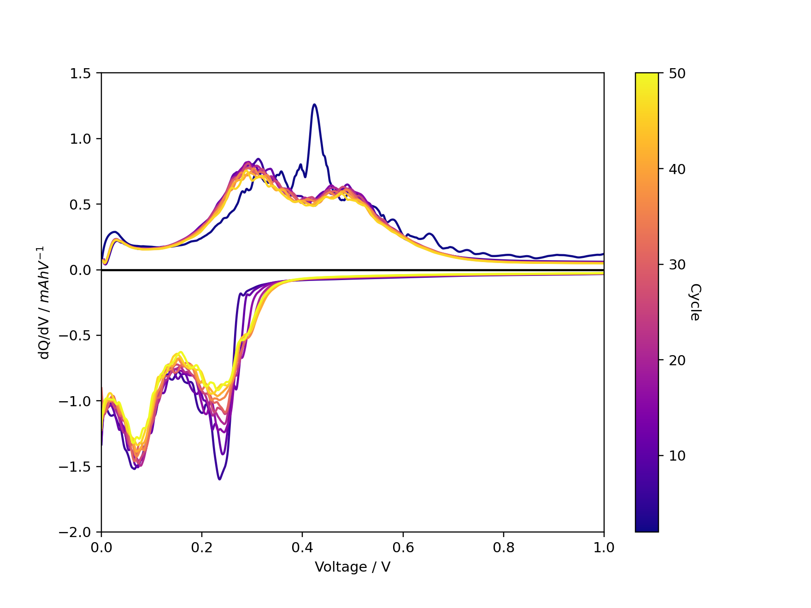

# navani

Module for processing and plotting electrochemical data from battery cyclers, combining other open source libraries to create pandas dataframes with a normalized schema across multiple cycler brands.
Contains functions to compute dQ/dV and dV/dQ.

Currently supports:

- BioLogic MPR (`.mpr`)
- Arbin res files (`.res`)
- Simple `.txt` and Excel `.xls`/`.xlsx` formats produced by e.g., Arbin, Ivium and Lanhe/Lande
- Neware NDA and NDAX (`.nda`, `.ndax`)

The main dependencies are :

- pandas
- [galvani](https://github.com/echemdata/galvani) (BioLogic MPR) 
- [mdbtools](https://github.com/mdbtools/mdbtools) (for reading Arbin's .res files with galvani).
- [NewareNDA](https://github.com/Solid-Energy-Systems/NewareNDA) (for reading Neware's NDA and NDAx formats).

## Installation

It is stronly recommended to use a fresh Python environment to install navani, using e.g., `conda create` or `python -m venv <chosen directory`.
To install navani, either clone this repository and install from your local copy:

```shell
git clone git@github.com/BenSmithGreyGroup/navani
cd navani
pip install .
```

or install directly from GitHub with `pip`:

```shell
pip install git+https://github.com/BenSmithGreyGroup/navani
```

The additional non-Python mdbtools dependency to `galvani` that is required to read Arbin's `.res` format can be installed on Ubuntu via `sudo apt install mdbtools`, with similar instructions available for other Linux distributions.

## Usage

The main entry point to navani is the `navani.echem.echem_file_loader` function, which will do file type detection and return a pandas dataframe.
Many different plot types are then available, as shown below:

```python
import pandas as pd
import navani.echem as ec

df = ec.echem_file_loader(filepath)
fig, ax = ec.charge_discharge_plot(df, 1)
```


```python
for cycle in [1, 2]:
    mask = df['half cycle'] == cycle
    voltage, dqdv, capacity = ec.dqdv_single_cycle(df['Capacity'][mask], df['Voltage'][mask],
                                                   window_size_1=51,
                                                    polyorder_1=5,
                                                    s_spline=0.0,
                                                    window_size_2=51,
                                                    polyorder_2=5,
                                                    final_smooth=True)
    plt.plot(voltage, dqdv)

plt.xlim(0, 0.5)
plt.xlabel('Voltage / V')
plt.ylabel('dQ/dV / mAhV$^{-1}$')
```


```python
fig, ax = ec.multi_dqdv_plot(df, cycles=cycles,
                    colormap='plasma',
                    window_size_1=51,
                    polyorder_1=5,
                    s_spline=1e-7,
                    window_size_2=251,
                    polyorder_2=5,
                    final_smooth=True)
```

