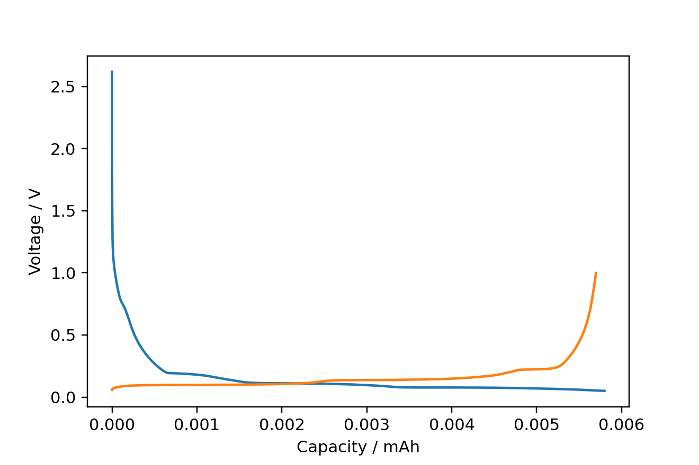

# navani
Module for processing and plotting electrochemical data from battery cyclers. Conatins functions to extract dQ/dV.

The main dependencies are galvani and mdbtools.

galvani : https://github.com/echemdata/galvani
This can be installed using pip:
`pip install galvani`

mdbtools
This can be installed on linux and mac using:
`sudo apt install mdbtools`


```
import pandas as pd
import navani.echem as ec

df = ec.echem_file_loader(filepath)
fig, ax = ec.charge_discharge_plot(df, 1)

```

